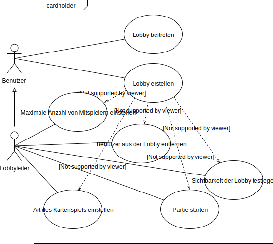

# __Einführung__

## Beschreibung

Cardholder ist eine Applikation, die es ermöglicht online Kartenspiele
zu spielen. Dabei kann man mit Freunden und Menschen aus aller Welt
spielen. Es gibt eine Auswahl von verschiedenen Kartenspielen. Die
Nutzer können die Kartenspiele ohne Anmeldung spielen. Spieler sollen
andere Nutzer zu einem Spiel einladen können. Cardholder ist als App und
als Webseite verfügbar.

## Ziele

Das Ziel von Cardholder ist es, dass Familie, Freunde und
Kartenspiel-Begeisterte zusammen Kartenspiele spielen können. Die
Motivation ist eine freie und für jeden zugängliche Software
bereitzustellen. Es werden verschiedene Kartenspiele zur Verfügung
gestellt.

Cardholder setzt vorraus, dass die Nutzer die entsprechenden Regeln der
jeweiligen Kartenspiele kennen. Weitere Vorkenntnisse sind nicht
erforderlich.

Bei Cardholder ist es nicht möglich eigene Kartenspiele hinzuzufügen.
Des Weiteren ist es nicht möglich seinen Spielstand zu speichern.

# __Anforderungen__

## Stakeholder

| Funktion      | Name                     | Kontakt                         | Verfügbarkeit | Wissen                                       | Interesse & Ziele                                        | Relevanz    |
|:--------------|:-------------------------|:--------------------------------|:--------------|:---------------------------------------------|:---------------------------------------------------------|:------------|
| Benutzer      | -                        | -                               | -             | Kennt die Regeln der jeweiligen Kartenspiele | Möchte mit anderen Benutzern online Kartenspiele spielen | Endnutzer   |
| Product-Owner | Prof. Dr. Jörg Brunsmann | joerg.brunsmann@fh-bielefeld.de | -             | Vertraut mit Fullstack-Anwendungen           | Koordination                                             | Entscheider |

## Funktionale Anforderungen

    - Use-Case Diagramme
    - Strukturierung der Diagramme in funktionale Gruppen

## Nicht-funktionale Anforderungen

### Rahmenbedingungen

    - Normen, Standards, Protokolle, Hardware, externe Vorgaben

### Betriebsbedingungen

__Mindestanforderungen an den Web Browser für die Web Anwendung__

| Browser           | Version |
|:------------------|:--------|
| Internet Explorer | 11      |
| Edge              | 15      |
| Firefox           | 54      |
| Chrome            | 51      |
| Safari            | 10      |
| Opera             | 38      |

__Mindestanforderungen an das mobile Endgerät für die App__

| Betriebssystem | Version |
|:---------------|:--------|
| iOS            | 8       |
| Android (ARM)  | 4.1     |

__Mindestanforderungen an den Server für das Backend__

| Programmiersprache | Version |
|:-------------------|:--------|
| Python             | 3.5     |

### Qualitätsmerkmale

| Qualitätsmerkmal           |      sehr gut      |        gut         |       normal       |   nicht relevant   |
|:---------------------------|:------------------:|:------------------:|:------------------:|:------------------:|
| **Zuverlüssigkeit**        |                    |                    |                    |                    |
| Fehlertoleranz             |         -          |         -          | :heavy_check_mark: |         -          |
| Wiederherstellbarkeit      |         -          |         -          |         -          | :heavy_check_mark: |
| Ordnungsmäßigkeit          |         -          |         -          |         -          | :heavy_check_mark: |
| Richtigkeit                |         -          | :heavy_check_mark: |         -          |         -          |
| Konformität                |         -          |         -          |         -          | :heavy_check_mark: |
| **Benutzerfreundlichkeit** |                    |                    |                    |                    |
| Installierbarkeit          | :heavy_check_mark: |         -          |         -          |         -          |
| Verständlichkeit           | :heavy_check_mark: |         -          |         -          |         -          |
| Erlernbarkeit              | :heavy_check_mark: |         -          |         -          |         -          |
| Bedienbarkeit              | :heavy_check_mark: |         -          |         -          |         -          |
| **Performance**            |                    |                    |                    |                    |
| Zeitverhalten              |         -          | :heavy_check_mark: |         -          |         -          |
| Effizienz                  | :heavy_check_mark: |         -          |         -          |         -          |
| **Sicherheit**             |                    |                    |                    |                    |
| Analysierbarkeit           |         -          |         -          |         -          | :heavy_check_mark: |
| Modifizierbarkeit          |         -          |         -          | :heavy_check_mark: |         -          |
| Stabilität                 |         -          | :heavy_check_mark: |         -          |         -          |
| Prüfbarkeit                |         -          |         -          |         -          | :heavy_check_mark: |

## Graphische Benutzerschnittstelle

### App

Die GUI-Mockups der mobilen Anwendung sind vorrübergehend
[hier](https://xd.adobe.com/view/b9aff4c3-81df-4940-595e-a1ad0d00664d-cf9e/)
zu finden und werden dem Dokument, in der finalen Version, zu einem
späteren Zeitpunkt, hinzugefügt.

### Web-Anwendnung

Die GUI-Mockups für die Web-Anwendung sind ebenfalls noch nicht fertig
und sind als Prototyp
[hier](https://xd.adobe.com/view/63e12a07-a012-4216-700c-1e0274695143-15d0/)
zu betrachten.

    - GUI-Mockups passend zu User Stories
    - Screens mit Überschrift kennzeichnen, die im Inhaltsverzeichnis zu sehen ist
    - Unter den Screens darstellen (bzw. verlinken), welche User Stories mit dem Screen abgehandelt werden
    - Modellierung der Navigation zwischen den Screens der GUI-Mockups als Zustandsdiagramm

## Anforderungen im Detail

    - User Stories mit Akzeptanzkritierien 
    - Optional: Name (oder ID) und Priorität ("Must", "Should", "Could", "Won't")
    - Strukturierung der User Stories in funktionale Gruppen

### User Stories

| **Als**     | **möchte ich**                                                        | **so dass**                                                         | **Akzeptanz**                                                                               |
|:------------|:----------------------------------------------------------------------|:--------------------------------------------------------------------|:--------------------------------------------------------------------------------------------|
| Benutzer    | Kartenspiele online spielen                                           | ich mit anderen Benutzern Kartenspiele spielen kann                 | Spiel ist spielbar                                                                          |
| Benutzer    | eine Lobby erstellen                                                  | ich als Lobbyleiter mit anderen Benutzern spielen kann              | Lobby ist erstellt                                                                          |
| Lobbyleiter | die maximale Anzahl von Benutzern in einer Lobby einstellen           | festlegen kann mit wie vielen Leuten ich zusammen spiele            | Höchstens die eingestellte Anzahl an Benutzern der Lobby beitreten können                   |
| Lobbyleiter | die Art des Kartenspiels einstellen                                   | verschiedene Kartenspiele spielen kann                              | Art des Kartenspiels ist eingestellt                                                        |
| Lobbyleiter | eine Lobby auf öffentlich oder privat schalten                        | ich kontrollieren kann, wer der Lobby beitreten kann                | Lobby auf öffentlich oder privat schaltbar                                                  |
| Lobbyleiter | einen Freund einladen                                                 | ich mit einem bestimmten Freund zusammen spielen kann               | Freund kann beitreten                                                                       |
| Lobbyleiter | Benutzer aus der Lobby entfernen                                      | ungewollte Benutzer entfernen kann                                  | Anderer Benutzer ist entfernt                                                               |
| Lobbyleiter | die Partie starten                                                    | ich ein Kartenspiel spielen kann                                    | Alle Benutzer aus der Lobby sind zusammen in einer Partie                                   |
| Benutzer    | die Liste aller öffentlichen Lobbys anzeigen                          | ich eine dieser Lobbys auswählen kann                               | Liste aller öffentlichen Lobbys wird angezeigt                                              |
| Benutzer    | einer öffentlichen Lobby beitreten                                    | ich mit anderen Benutzern zusammen spielen kann                     | Ich bin einer Lobby beigetreten                                                             |
| Benutzer    | einer Lobby, in die ich eingeladen wurde, beitreten                   | ich zusammen mit anderen Benutzern spielen kann                     | Ich bin einer Lobby beigetreten                                                             |
| Benutzer    | die aktuelle Partie verlassen                                         | ich aus unbestimmten Gründen früher aussteigen kann                 | Ich habe die aktuelle Partie verlassen                                                      |
| Benutzer    | nach einer Partie wieder mit den selben Benutzern in einer Lobby sein | ich ggfs. eine weitere Partie mit den selben Benutzern spielen kann | Ich bin nach abgeschlossener Runde mit den Spielern aus der vorherigen Runde in einer Lobby |

# __Technische Beschreibung__

## Systemübersicht

    - Systemarchitekturdiagramm ("Box-And-Arrow" Diagramm)
    - Kommunikationsprotokolle, Datenformate

## Softwarearchitektur

    - Darstellung von Softwarebausteinen (Module, Schichten, Komponenten)

## Schnittstellen

    - Schnittstellenbeschreibung
    - Auflistung der nach außen sichtbaren Schnittstelle der Softwarebausteine

## Datenmodell

    - Konzeptionelles Analyseklassendiagramm (logische Darstellung der Konzepte der Anwendungsdom�ne)
    - Modellierung des physikalischen Datenmodells 
      - RDBMS: ER-Diagramm bzw. Dokumentenorientiert: JSON-Schema

## Abläufe

    - Aktivitätsdiagramme für relevante Use Cases
    - Aktivitätsdiagramm für den Ablauf sämtlicher Use Cases

## Entwurf

    - Detaillierte UML-Diagramme für relevante Softwarebausteine

# __Projektorganisation__

## Annahmen

| Baustein  | Technologie         | Programmiersprache | Repository                                        |   |
|:----------|:--------------------|:-------------------|:--------------------------------------------------|:--|
| App       | Flutter _(1.2.1)_   | _Dart (2.2)_       | [Link](https://github.com/cardholder/app)         |   |
| Webseite  | React _(16.8)_      | _JavaScript (ES6)_ | [Link](https://github.com/cardholder/website)     |   |
| Backend   | Django _(2.2)_      | _Python (3.5)_     | [Link](https://github.com/cardholder/server-side) |   |
| Datenbank | mariaDB _(10.1.38)_ | _MySQL (15.1)_     | [Link](https://github.com/cardholder/server-side) |   |

## Verantwortlichkeiten

| Softwarebaustein | Person(en)                  |
|:-----------------|:----------------------------|
| Frontend         | Marti Stuwe, Patrick Reinke |
| Backend          | Stefan Kröker               |

### Rollen

#### App-Entwickler

Entwickelt eine grafische Benutzeroberfläche für mobile Endgeräte.

#### Web-Entwickler

Entwickelt eine grafische Benutzeroberfläche für moderne Browser.

#### Backend-Entwickler

Implementiert die funktionale Logik der Anwendung. Hierbei werden zudem
diverse Datenquellen integriert für die Anwendung bereitgestellt.

### Rollenzuordnung

| Name           | Rolle              |
|:---------------|:-------------------|
| Marti Stuwe    | App-Entwickler     |
| Patrick Reinke | Web-Entwickler     |
| Stefan Kröker  | Backend-Entwickler |

## Grober Projektplan

### Meilensteine

- __KW 18 (30.4)__
  - Beschreibung
  - Ziele
  - Stakeholder
  - Use-Case
  - Betriebsbedingungen
  - Qualitätsmerkmale

- __KW 19 (7.5)__
  - Mockups
  - Systemarchitekturdiagramm
  - Softwarearchitekturdiagramm
  - Datenbank Modell
  - Nicht-funktionale Anforderungen
  - Zustandsdiagramm
  - Sequenzdiagramm
  - Kanban-Boards für Bausteine

- __KW 20 (14.5)__
  - Design Umsetzung
  - Kommunikationsprotokoll
  - Schnittstellen

- __KW 21 (21.5)__
  -  Prototyp Fertigstellung
  -  Kommunikationsprotokoll Einbindung

- __KW 22 (28.5)__
  - Prototyp finalisieren

- __KW 23 (4.6)__
  - 33% der Funktionalität, Tests und Dokumentation

- __KW 24 (11.6)__
  - 66% der Funktionalität, Tests und Dokumentation

- __KW 25 (18.6)__
  - 100% der Funktionalität, Tests und Dokumentation

- __KW 26 (25.5)__
  - Fertigstellung der Projekt Präsentation

- __KW 27 (2.7)__
  - Projekt Präsentation

# __Anhänge__

## Glossar

**Benutzer:** Jede Person ist ein Benutzer  
**Lobby:** Empfangsraum/Vorhalle (*methaphorisch*) für Spieler  
**Lobbyleiter:** Ein Lobbyleiter ist ein Benutzer, der eine Lobby
erstellt hat. Er ist Leiter dieser Lobby und kann Einstellungen treffen.

## Referenzen

    - Handbücher, Gesetze

## Index

