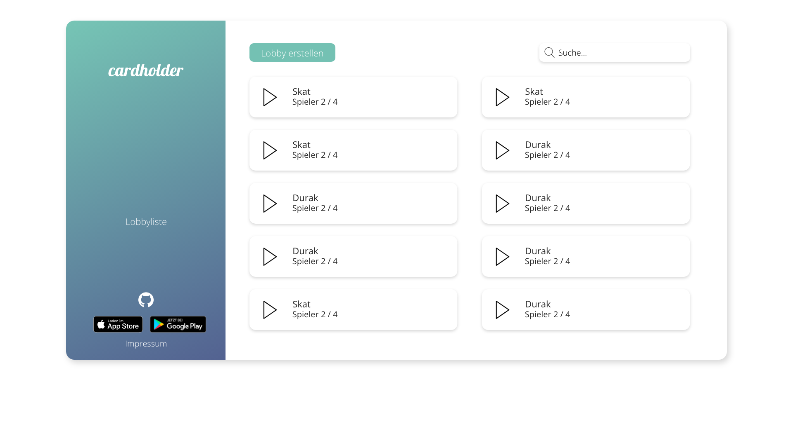
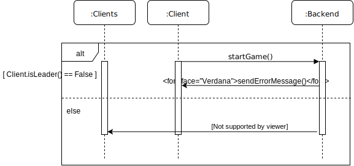
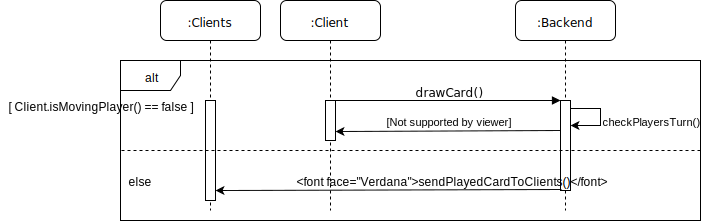
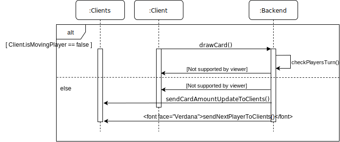

# **Einführung**

## Beschreibung

Cardholder ist eine Applikation, die es ermöglicht online Kartenspiele
zu spielen. Dabei kann man mit Freunden und Menschen aus aller Welt
spielen. Es gibt eine Auswahl von verschiedenen Kartenspielen. Die
Nutzer können die Kartenspiele ohne Anmeldung spielen. Spieler sollen
andere Nutzer zu einem Spiel einladen können. Cardholder ist als App und
als Webseite verfügbar.

## Ziele

Das Ziel von Cardholder ist es, dass Familie, Freunde und
Kartenspiel-Begeisterte zusammen Kartenspiele spielen können. Die
Motivation ist eine freie und für jeden zugängliche Software
bereitzustellen. Es werden verschiedene Kartenspiele zur Verfügung
gestellt.

Cardholder setzt vorraus, dass die Nutzer die entsprechenden Regeln der
jeweiligen Kartenspiele kennen. Weitere Vorkenntnisse sind nicht
erforderlich.

Bei Cardholder ist es nicht möglich eigene Kartenspiele hinzuzufügen.
Des Weiteren ist es nicht möglich seinen Spielstand zu speichern.

# **Anforderungen**

## Stakeholder

| Funktion      | Name                     | Kontakt                         | Verfügbarkeit | Wissen                                       | Interesse & Ziele                                        | Relevanz    |
| :------------ | :----------------------- | :------------------------------ | :------------ | :------------------------------------------- | :------------------------------------------------------- | :---------- |
| Benutzer      | -                        | -                               | -             | Kennt die Regeln der jeweiligen Kartenspiele | Möchte mit anderen Benutzern online Kartenspiele spielen | Endnutzer   |
| Product-Owner | Prof. Dr. Jörg Brunsmann | joerg.brunsmann@fh-bielefeld.de | -             | Vertraut mit Fullstack-Anwendungen           | Koordination                                             | Entscheider |

## Funktionale Anforderungen


    - Use-Case Diagramme
    - Strukturierung der Diagramme in funktionale Gruppen

## Nicht-funktionale Anforderungen

### Rahmenbedingungen

- Das Spiel ist 24/7 erreichbar.
- Die Kommunikation findet über Sockets statt.

### Betriebsbedingungen

**Mindestanforderungen an den Web Browser für die Web Anwendung**

| Browser           | Version |
| :---------------- | :------ |
| Internet Explorer | 11      |
| Edge              | 15      |
| Firefox           | 54      |
| Chrome            | 51      |
| Safari            | 10      |
| Opera             | 38      |

**Mindestanforderungen an das mobile Endgerät für die App**

| Betriebssystem | Version |
| :------------- | :------ |
| iOS            | 8       |
| Android (ARM)  | 4.1     |

**Mindestanforderungen an den Server für das Backend**

| Programmiersprache | Version |
| :----------------- | :------ |
| Python             | 3.5     |

### Qualitätsmerkmale

| Qualitätsmerkmal           |      sehr gut      |        gut         |       normal       |   nicht relevant   |
| :------------------------- | :----------------: | :----------------: | :----------------: | :----------------: |
| **Zuverlässigkeit**        |                    |                    |                    |                    |
| Fehlertoleranz             |         -          |         -          | :heavy_check_mark: |         -          |
| Wiederherstellbarkeit      |         -          |         -          |         -          | :heavy_check_mark: |
| Ordnungsmäßigkeit          |         -          |         -          |         -          | :heavy_check_mark: |
| Richtigkeit                |         -          | :heavy_check_mark: |         -          |         -          |
| Konformität                |         -          |         -          |         -          | :heavy_check_mark: |
| **Benutzerfreundlichkeit** |                    |                    |                    |                    |
| Installierbarkeit          | :heavy_check_mark: |         -          |         -          |         -          |
| Verständlichkeit           | :heavy_check_mark: |         -          |         -          |         -          |
| Erlernbarkeit              | :heavy_check_mark: |         -          |         -          |         -          |
| Bedienbarkeit              | :heavy_check_mark: |         -          |         -          |         -          |
| **Performance**            |                    |                    |                    |                    |
| Zeitverhalten              |         -          | :heavy_check_mark: |         -          |         -          |
| Effizienz                  | :heavy_check_mark: |         -          |         -          |         -          |
| **Sicherheit**             |                    |                    |                    |                    |
| Analysierbarkeit           |         -          |         -          |         -          | :heavy_check_mark: |
| Modifizierbarkeit          |         -          |         -          | :heavy_check_mark: |         -          |
| Stabilität                 |         -          | :heavy_check_mark: |         -          |         -          |
| Prüfbarkeit                |         -          |         -          |         -          | :heavy_check_mark: |

## Graphische Benutzerschnittstelle

### App

#### Ladebildschirm


#### Hauptmenü


#### Anzeigename eingeben


#### Lobbyliste


#### Lobby erstellen


#### Lobby


#### Im Spiel


Der Prototyp ist weiterhin
[hier](https://xd.adobe.com/view/b9aff4c3-81df-4940-595e-a1ad0d00664d-cf9e/)
erreichbar.

### Web-Anwendnung

Die GUI-Mockups für die Web-Anwendung sind in 10 Teile aufgeteilt. Diese
sind aufgeteilt in Spiel, Home, Impressum, Lobby für Besitzer, Lobby für
normale Nutzer, Lobby erstellen, Lobbyliste, Suche, Eingabe in der Suche
und Username Eingabe.

#### Home


#### Impressum


#### Username Eingabe


#### Lobbyliste



#### Suche Eingabe


#### Suche


#### Lobby erstellen


#### Lobby für Leiter


#### Lobby für Nutzer


#### Spiel


Der Prototyp ist weiterhin
[hier](https://xd.adobe.com/view/63e12a07-a012-4216-700c-1e0274695143-15d0/)
erreichbar.

### Zustandsdiagramm


## Anforderungen im Detail

### User Stories

| **Als**     | **möchte ich**                                                        | **so dass**                                                         | **Akzeptanz**                                                                               | **Priorität** |
| :---------- | :-------------------------------------------------------------------- | :------------------------------------------------------------------ | :------------------------------------------------------------------------------------------ | :------------ |
| Benutzer    | Kartenspiele online spielen                                           | ich mit anderen Benutzern Kartenspiele spielen kann                 | Spiel ist spielbar                                                                          | Muss          |
| Benutzer    | eine Lobby erstellen                                                  | ich als Lobbyleiter mit anderen Benutzern spielen kann              | Lobby ist erstellt                                                                          | Muss          |
| Lobbyleiter | die maximale Anzahl von Benutzern in einer Lobby einstellen           | festlegen kann mit wie vielen Leuten ich zusammen spiele            | Höchstens die eingestellte Anzahl an Benutzern der Lobby beitreten können                   | Sollte        |
| Lobbyleiter | die Art des Kartenspiels einstellen                                   | verschiedene Kartenspiele spielen kann                              | Art des Kartenspiels ist eingestellt                                                        | Sollte        |
| Lobbyleiter | eine Lobby auf öffentlich oder privat schalten                        | ich kontrollieren kann, wer der Lobby beitreten kann                | Lobby auf öffentlich oder privat schaltbar                                                  | Sollte        |
| Lobbyleiter | einen Freund einladen                                                 | ich mit einem bestimmten Freund zusammen spielen kann               | Freund kann beitreten                                                                       | Muss          |
| Lobbyleiter | Benutzer aus der Lobby entfernen                                      | ungewollte Benutzer entfernen kann                                  | Anderer Benutzer ist entfernt                                                               | Sollte        |
| Lobbyleiter | die Partie starten                                                    | ich ein Kartenspiel spielen kann                                    | Alle Benutzer aus der Lobby sind zusammen in einer Partie                                   | Muss          |
| Benutzer    | die Liste aller öffentlichen Lobbys anzeigen                          | ich eine dieser Lobbys auswählen kann                               | Liste aller öffentlichen Lobbys wird angezeigt                                              | Sollte        |
| Benutzer    | einer öffentlichen Lobby beitreten                                    | ich mit anderen Benutzern zusammen spielen kann                     | Ich bin einer Lobby beigetreten                                                             | Sollte        |
| Benutzer    | einer Lobby, in die ich eingeladen wurde, beitreten                   | ich zusammen mit anderen Benutzern spielen kann                     | Ich bin einer Lobby beigetreten                                                             | Muss          |
| Benutzer    | die aktuelle Partie verlassen                                         | ich aus unbestimmten Gründen früher aussteigen kann                 | Ich habe die aktuelle Partie verlassen                                                      | Kann          |
| Benutzer    | nach einer Partie wieder mit den selben Benutzern in einer Lobby sein | ich ggfs. eine weitere Partie mit den selben Benutzern spielen kann | Ich bin nach abgeschlossener Runde mit den Spielern aus der vorherigen Runde in einer Lobby | Kann          |
| Benutzer    | einen Benutzernamen auswählen können                                  | meine Freunde mich erkennen können                                  | Benutzername wird angezeigt                                                                 | Sollte        |

# **Technische Beschreibung**

## Systemübersicht


## Softwarearchitektur


## Schnittstellen

### Datentypen

#### Player

| Name | Datentyp | Zusatz                     |
| :--- | :------- | :------------------------- |
| id   | Number   |                            |
| name | String   | 20 alphanumerische Zeichen |
| role | String   | leader / player            |

```json
{
  "id": 0,
  "name": "Player 1",
  "role": "leader"
}
```

#### Game

| Name        | Datentyp | Zusatz      |
| :---------- | :------- | :---------- |
| game_name   | String   |             |
| show_name   | String   | Anzeigename |
| max_players | Number   |             |

```json
{
  "game_name": "maumau",
  "show_name": "Mau Mau",
  "max_players": "8"
}
```

#### Lobby

| Name        | Datentyp | Zusatz                    |
| :---------- | :------- | :------------------------ |
| id          | String   | 7 alphanumerische Zeichen |
| game        | String   | Durak                     |
| visibility  | String   | public, private           |
| max_players | Number   | Zahl von 2 - 8            |
| players     | Player[] |                           |

```json
{
  "id": "hAsfh8n",
  "game": "Durak",
  "visibility": "private",
  "max_players": 8,
  "players": [
    {
      "id": 0,
      "name": "Player 1",
      "role": "leader"
    }
  ]
}
```

#### Card

| Name  | Datentyp | Zusatz     |
| :---- | :------- | :--------- |
| id    | Number   |            |
| value | String   |            |
| symbol | String  | d, c, s, h |

```json
{
  "id": 1,
  "value": "Q",
  "symbol": "d"
}
```

### Lobbylist

#### Clientnachrichten

##### Hello

Client verbindet sich mit dem Server.

```json
{}
```

#### Servernachrichten

##### Lobbylist

Wird dem Client geschickt um die Liste aller Lobbys anzuzeigen. Antwort
auf _[hello](#hello)_.

| Name    | Datentyp | Zusatz |
| :------ | :------- | :----- |
| lobbies | Lobby[]  |        |

```json
{
  "lobbies": [
    {
      "id": "hAsfh8n",
      "game": "Durak",
      "visibility": "private",
      "max_players": 8,
      "players": [
        {
          "id": 0,
          "name": "Player 1",
          "role": "leader"
        }
      ]
    }
  ]
}
```

##### Lobbylist Entry

Diese Nachricht wird allen Clients geschickt, wenn eine neue Lobby
erstellt wurde oder eine Aktualisierung stattgefunden hat.

| Name  | Datentyp | Zusatz |
| :---- | :------- | :----- |
| lobby | Lobby    |        |

```json
{
  "lobby": {
    "id": "hAsfh8n",
    "game": "Durak",
    "visibility": "private",
    "max_players": 8,
    "players": [
      {
        "id": 0,
        "name": "Player 1",
        "role": "leader"
      }
    ]
  }
}
```

##### Remove Lobbylist Entry

Diese Nachricht wird allen Clients geschickt, wenn die Lobby gelöscht
wird.

| Name     | Datentyp | Zusatz         |
| :------- | :------- | :------------- |
| lobby_id | String   | id einer Lobby |

```json
{
  "lobby_id": "hAsfh8n"
}
```


### Create

#### Clientnachrichten

##### Create Lobby

Wird dem Server geschickt, wenn ein Client eine neue Lobby erstellt hat.

| Name        | Datentyp | Zusatz          |
| :---------- | :------- | :-------------- |
| game        | String   | Durak           |
| visibility  | String   | public, private |
| max_players | Number   | Zahl von 2 - 8  |

```json
{
  "game": "Durak",
  "visibility": "private",
  "max_players": 8
}
```

#### Servernachrichten

##### Lobby created

Diese Nachricht wird dem Client geschickt, der die Lobby erstellt hat.

| Name | Datentyp | Zusatz                  |
| :--- | :------- | :---------------------- |
| id   | String   | id der erstellten Lobby |

```json
{
  "id": "hAsfh8n"
}
```

### Lobby

#### Clientnachrichten

##### Join Lobby

Wenn ein Client einer Lobby beitritt, schickt er diese Nachricht an den
Server.

| Name     | Datentyp | Zusatz       |
| :------- | :------- | :----------- |
| lobby_id | String   | id der Lobby |
| name     | String   | Benutzername |

```json
{
  "name": "Player 1"
}
```

##### Start Lobby

Wenn der Lobby Leader die Lobby startet, schickt er diese Nachricht an
den Server.

```json
{
    "message": "start"
}
```

##### Kick Lobby

Wenn ein Client von der Lobby gekickt wird.

| Name      | Datentyp | Zusatz |
| :-------- | :------- | :----- |
| player_id | Number   |        |

```json
{
    "player_id": 1
}
```

#### Servernachrichten

##### Start Game

Der Server schickt diese Nachricht an die Clients, damit diese das Spiel laden.

```json
{
    "message": "Game is started"
}
```

##### Update Lobby

Wenn ein Player die Lobby verlässt oder betritt, schickt der Server
diese Nachricht alle Clients.

| Name    | Datentyp | Zusatz |
| :------ | :------- | :----- |
| players | Player[] |        |

```json
{
  "players": [
    {
      "id": 0,
      "name": "Player 1",
      "role": "leader"
    }
  ]
}
```

### Mau Mau

#### Clientnachrichten

##### Join game

Ein Spieler tritt aus der Lobby dem Spiel bei.

| Name        | Datentyp | Zusatz |
| :---------- | :------- | :----- |
| player_id   | Number   |        |

```json
{
  "player_id": 0
}
```


##### Karte legen

Ein Spieler legt eine Karte ab.

| Name   | Datentyp | Zusatz |
| :----- | :------- | :----- |
| card   | Card     |        |
| player | Player   |        |

```json
{
  "card": {
    "id": 1,
    "value": "Q",
    "symbol": "d"
  },
  "player": {
    "id": 0,
    "name": "Player 1",
    "role": "leader"
  }
}
```

##### Ziehen

Ein Spieler muss eine Karte ziehen eine Nachricht vom Stapel.

| Name   | Datentyp | Zusatz |
| :----- | :------- | :----- |
| player | Player   |        |

```json
{
  "player": {
    "id": 0,
    "name": "Player 1",
    "role": "leader"
  }
}
```

##### Bubenwunsch

Ein Spieler wünscht sich eine Kartenfarbe.

| Name   | Datentyp | Zusatz  |
| :----- | :------- | :------ |
| symbol | Char     | s,c,d,h |

```json
{
  "symbol": "d"
}
```

#### Servernachrichten

##### Initialized Game

Ein Spieler tritt der Lobby bei und erhält die Nötigen Daten um das Spiel beim Client darzustellen.

| Name                      | Datentyp | Zusatz                       |
| :------------------------ | :------- | :--------------------------- |
| players                   | Player[] |                              |
| cards                     | Cards[]  |                              |
| current_player            | Player   | Spieler der am Zug ist       |
| remaining_cards           | Number   | Spieler der am Zug ist       |
| top_card_of_discard_pile  | Player   | Spieler der am Zug ist       |


```json
{
  "players": [
    {
      "id": 0,
      "name": "Player 1",
      "role": "leader"
    }
  ],
  "cards": [
    {
      "id": 1,
      "value": "Q",
      "symbol": "d"
    }
  ],
  "current_player": {
    "id": 0,
    "name": "Player 1",
    "role": "leader"
  },
  "remaining_cards": 16,
  "top_card_of_discard_pile": {
      "id": 1,
      "value": "Q",
      "symbol": "d"
    }
}
```

##### Ziehen

Ein Spieler muss eine Karte ziehen eine Nachricht vom Stapel.

| Name            | Datentyp | Zusatz                       |
| :-------------- | :------- | :--------------------------- |
| cards_drawn     | Card[]   |                              |
| remaining_cards | Number   |                              |
| current_player  | Player   | Spieler der am Zug ist       |

```json
{
  "cards_drawn": [
    {
      "id": 1,
      "value": "Q",
      "symbol": "d"
    }
  ],
  "remaining_cards": 16,
  "current_player": {
    "id": 0,
    "name": "Player 1",
    "role": "leader"
  }
}
```

##### Update ziehen

Der Server sendet jedem Spieler, welcher Spieler wie viel gezogen hat.

| Name            | Datentyp | Zusatz                       |
| :-------------- | :------- | :--------------------------- |
| player          | Player   |                              |
| cardAmount      | Number   |                              |
| remaining_cards | Number   |                              |
| current_player  | Player   | Spieler der am Zug ist       |

```json
{
  "player": {
    "id": 0,
    "name": "Player 1",
    "role": "leader"
  },
  "cardAmount": 2,
  "remaining_cards": 16,
  "current_player": {
    "id": 0,
    "name": "Player 1",
    "role": "leader"
  }
}
```

##### Update legen

Der Server sendet jedem Spieler, welcher Spieler was gelegt hat.

| Name            | Datentyp | Zusatz                       |
| :-------------- | :------- | :--------------------------- |
| player          | Player   |                              |
| card            | Card     |                              |
| current_player  | Player   | Spieler der am Zug ist       |

```json
{
  "player": {
    "id": 0,
    "name": "Player 1",
    "role": "leader"
  },
  "card": {
    "id": 1,
    "value": "Q",
    "symbol": "d"
  },
  "current_player": {
    "id": 0,
    "name": "Player 1",
    "role": "leader"
  }
}
```

##### Sieger

Sieger wird an Spiel geschickt.

| Name      | Datentyp | Zusatz |
| :-------- | :------- | :----- |
| message   | String   |        |
| player_id | Number   |        |

```json
{
  "message": "Sieger",
  "player_id": 0
}
```


##### Update Bubenwunsch

Der Server sendet jedem Spieler, welcher Kartenfarbe sich gewünscht wurde und wer der aktuelle Spieler ist.

| Name           | Datentyp | Zusatz  |
| :------------- | :------- | :------ |
| symbol         | Char     | s,c,d,h |
| current_player | Player   |         |

```json
{
  "symbol": "s",
  "current_player": {
    "id": 0,
    "name": "Player 1",
    "role": "leader"
  }
}
```


##### Spielerwunsch

Der Server sendet dem Spieler, dass er sich eine Farbe wünschen soll.

| Name    | Datentyp | Zusatz |
| :------ | :------- | :----- |
| message | String   |        |

```json
{
  "message": "Wuensch dir was"
}
```

##### Fehlerhafte Zug

Spieler macht etwas unerlaubtes.

| Name    | Datentyp | Zusatz |
| :------ | :------- | :----- |
| message | String   |        |

```json
{
  "message": "error message"
}
```

    - Schnittstellenbeschreibung
    - Auflistung der nach außen sichtbaren Schnittstelle der Softwarebausteine

## Datenmodell


## Abläufe

### Sequenzdiagramme

#### Spiel öffnen


#### Lobby beitreten


#### Lobby erstellen


#### Lobby verlassen


#### Spiel starten



#### Karte legen



#### Karte ziehen




## Entwurf

    - Detaillierte UML-Diagramme für relevante Softwarebausteine

# **Projektorganisation**

## Annahmen

| Baustein  | Technologie         | Programmiersprache | Repository                                        |
| :-------- | :------------------ | :----------------- | :------------------------------------------------ |
| App       | Flutter _(1.5.4)_   | _Dart (2.3)_       | [Link](https://github.com/cardholder/app)         |
| Webseite  | React _(16.8)_      | _JavaScript (ES6)_ | [Link](https://github.com/cardholder/website)     |
| Backend   | Django _(2.2)_      | _Python (3.5)_     | [Link](https://github.com/cardholder/server-side) |
| Datenbank | mariaDB _(10.1.38)_ | _MySQL (15.1)_     | [Link](https://github.com/cardholder/server-side) |

## Verantwortlichkeiten

| Softwarebaustein | Person(en)                  |
| :--------------- | :-------------------------- |
| Frontend         | Marti Stuwe, Patrick Reinke |
| Backend          | Stefan Kröker               |

### Rollen

#### App-Entwickler

Entwickelt eine grafische Benutzeroberfläche für mobile Endgeräte.

#### Web-Entwickler

Entwickelt eine grafische Benutzeroberfläche für moderne Browser.

#### Backend-Entwickler

Implementiert die funktionale Logik der Anwendung. Hierbei werden zudem
diverse Datenquellen integriert und für die Anwendung bereitgestellt.

### Rollenzuordnung

| Name           | Rolle              |
| :------------- | :----------------- |
| Marti Stuwe    | App-Entwickler     |
| Patrick Reinke | Web-Entwickler     |
| Stefan Kröker  | Backend-Entwickler |

## Grober Projektplan

### Meilensteine

- **KW 18 (30.4)**

  - Beschreibung
  - Ziele
  - Stakeholder
  - Use-Case
  - Betriebsbedingungen
  - Qualitätsmerkmale

- **KW 19 (7.5)**

  - Mockups
  - Systemarchitekturdiagramm
  - Softwarearchitekturdiagramm
  - Datenbank Modell
  - Nicht-funktionale Anforderungen
  - Zustandsdiagramm
  - Kanban-Boards für Bausteine

- **KW 20 (14.5)**

  - Design Umsetzung
  - Kommunikationsprotokoll
  - Schnittstellen

- **KW 21 (21.5)**

  - Prototyp Fertigstellung
  - Kommunikationsprotokoll Einbindung

- **KW 22 (28.5)**

  - Prototyp finalisieren

- **KW 23 (4.6)**

  - 33% der Funktionalität, Tests und Dokumentation

- **KW 24 (11.6)**

  - 66% der Funktionalität, Tests und Dokumentation

- **KW 25 (18.6)**

  - 100% der Funktionalität, Tests und Dokumentation

- **KW 26 (25.5)**

  - Fertigstellung der Projekt Präsentation

- **KW 27 (2.7)**
  - Projekt Präsentation

# **Anhänge**

## Glossar

**Benutzer:** Jede Person ist ein Benutzer  
**Lobby:** Empfangsraum/Vorhalle (_methaphorisch_) für Spieler  
**Lobbyleiter:** Ein Lobbyleiter ist ein Benutzer, der eine Lobby
erstellt hat. Er ist Leiter dieser Lobby und kann Einstellungen treffen.

## Referenzen

    - Handbücher, Gesetze

## Index
